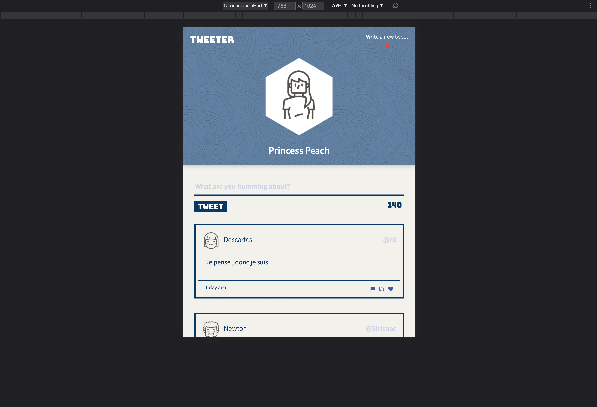
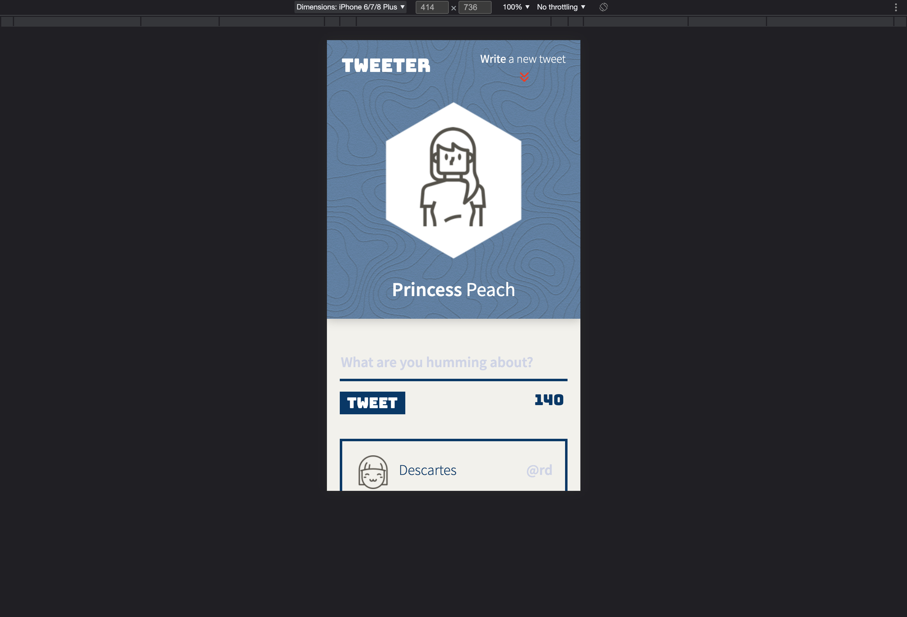
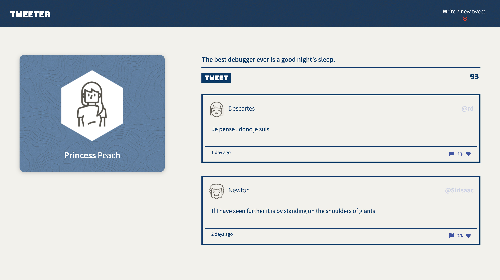
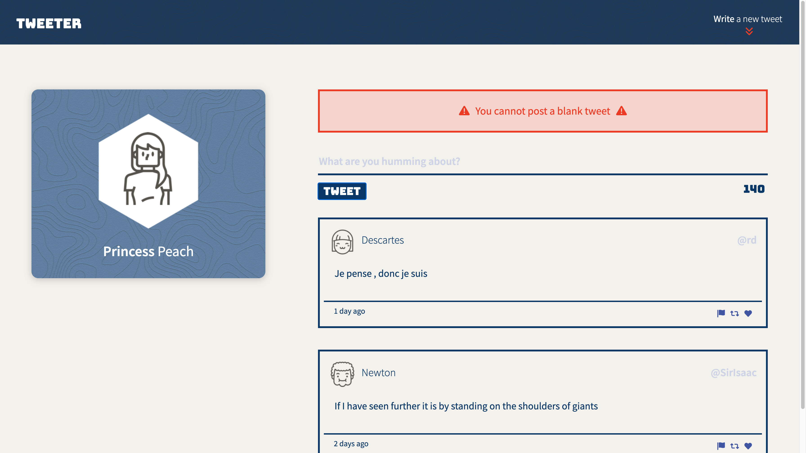
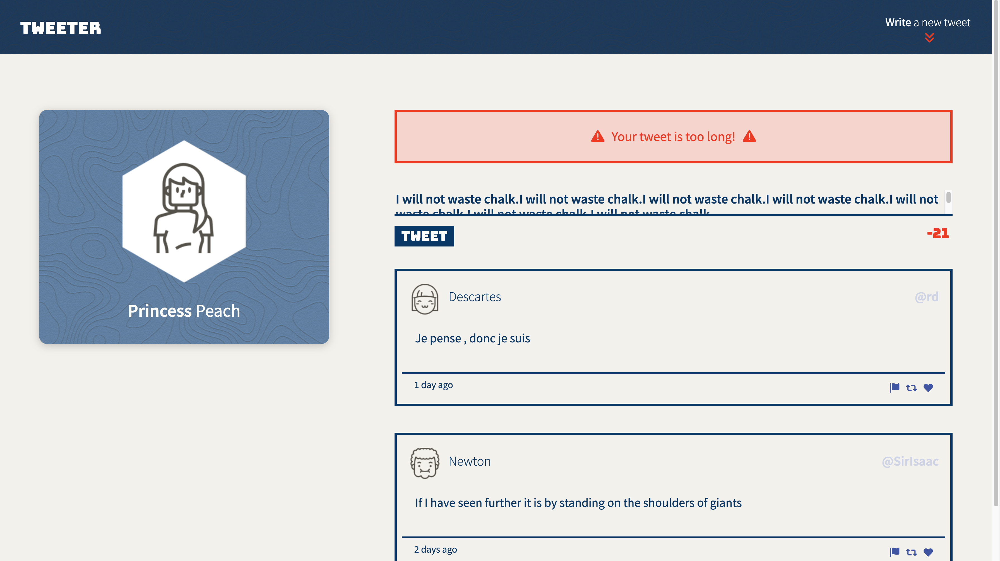

# Tweeter Project

Tweeter is a simple, single-page Twitter clone with the functionality of posting tweets and viewing them on the main tweeter page. Tweeter is a mobile-, tablet- and desktop-friendly app.
It was built using HTML, CSS, JavaScript, AJAX and jQuery for the front-end, and Express and Node for the back-end (back-end built by Lighthouse Labs).

## Final Product

The tweeter app contains a form field in which you can write and submit your new tweets. 🐥

Tweeter is a responsive app, making it also tablet- and mobile-friendly. 👍

The tweet form contains a counter which displays the number of characters that are left until you reach the character limit. Once you submit a tweet, your new tweet will be added to the stack of tweets below. ✏️

If you attempt to submit a blank tweet, an error message will appear. ⚠️

Tweeter is designed to be quick and easy. This is why an error message will appear when your tweet is more than 140 characters long. This message will not disappear until your tweet meets our requirement. 🚫

## Getting Started

1. [Create](https://docs.github.com/en/repositories/creating-and-managing-repositories/creating-a-repository-from-a-template) a new repository using this repository as a template.
2. Clone your repository onto your local device.
3. Install dependencies using the `npm install` command.
4. Start the web server using the `npm run local` command. The app will be served at <http://localhost:8080/>.
5. Go to <http://localhost:8080/> in your browser.

## Dependencies

- Express
- Body-parser
- Chance
- Express
- Node 5.10.x or above
